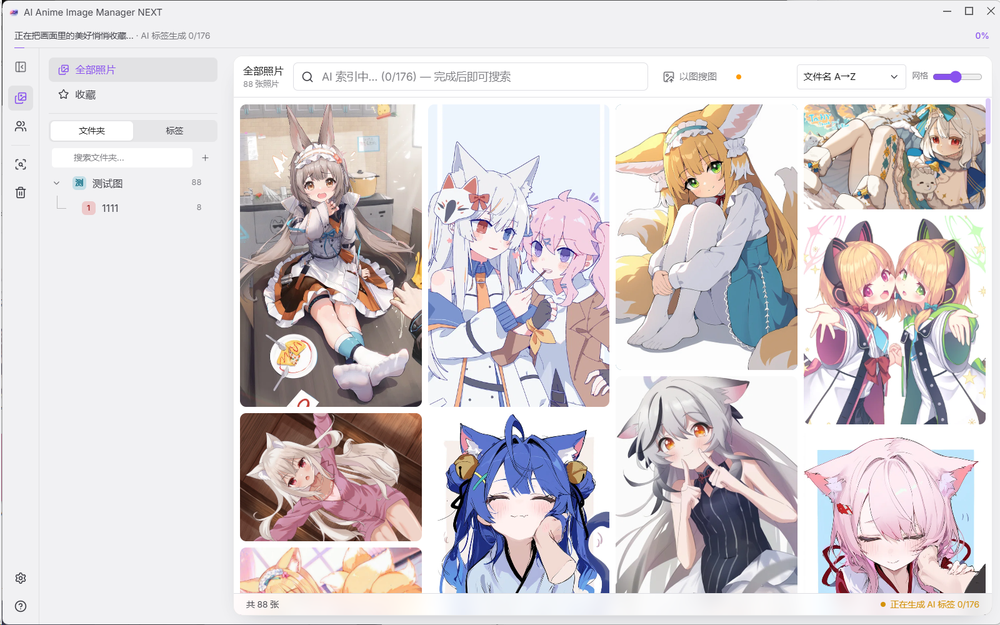
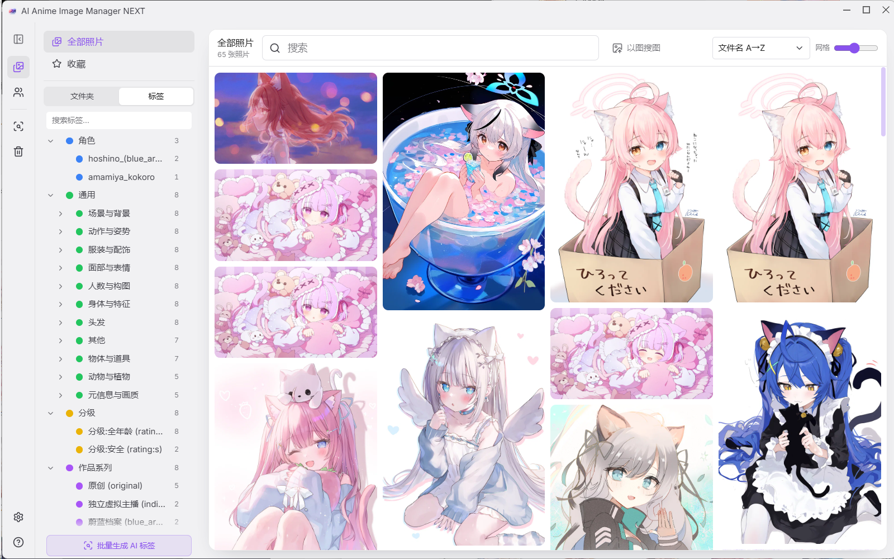
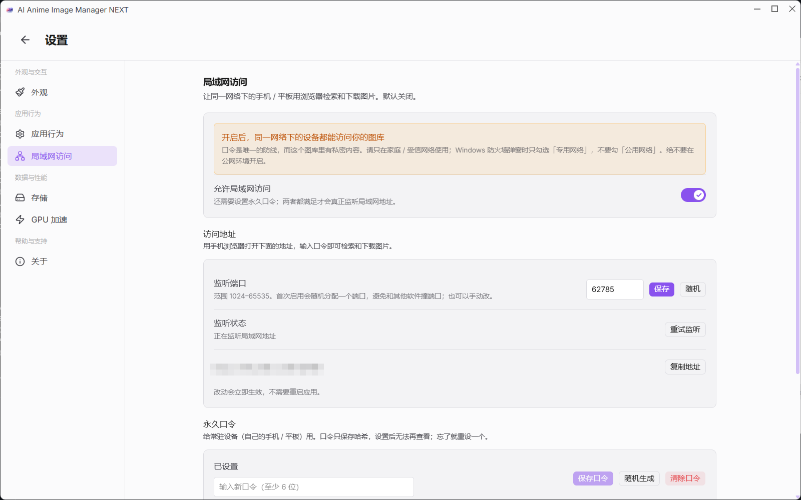

# AI Anime Image Manager NEXT（PixAI Tagger v1.0 · 自用修改）

> **本项目是「AI Image Manager」的修改版** —— 基于 [Uyoung666/ai-image-manager](https://github.com/Uyoung666/ai-image-manager) **v2.2.3** 修改而来。
> 上游采用 MIT License（Copyright © 2025 Luan Roger）；本仓库为个人自用修改版，与上游作者无关。

基于 **[Uyoung666/ai-image-manager](https://github.com/Uyoung666/ai-image-manager) v2.2.3**（MIT License，Copyright © 2025 Luan Roger）的**个人自用修改版**。
上游原始源码就在本目录的 `upstream/ai-image-manager-v2.2.3.zip` 里，**自包含**：

```
upstream/ai-image-manager-v2.2.3.zip     ← 上游 v2.2.3 原始源码（SHA256: b3679a512ea3298e2693a8d457b5485521aa7e69fe8e50874d89b0564fefc7ee）
upstream/src/ai-image-manager-2.2.3/     ← 本版本的工作树（= 上游 + 补丁）
patches/                                  ← 相对上游的补丁（干净解压 + git apply 可逐字节还原本工作树）
```

## 最近更新（2026-10）

**主打：标签检索提速。** 点标签后的等待时间（实测图库 79,777 张 / 30,896 个标签）：

| 操作 | 优化前 | 优化后 |
|---|---|---|
| 点「通用」（子树 15,057 个标签的根分类） | **20.97 秒** | **0.32 秒** |
| 点「角色 ∧ 画风」（多标签） | **64.74 秒** | **2.36 秒** |
| 点「角色 ∧ 元信息」（多标签） | **60.02 秒** | **2.08 秒** |
| 点标签后「进得去、但还要再等两三秒才出图」 | 每点一次标签都把 3 万个标签重拉一遍 | **已修复** |
| 标签徽标数字重算 | **4.44 秒** | **0.04 秒**，且重启不再重算 |

同一轮还修了：顶栏加打标「暂停」键；「移除文件夹」之后开机补扫不再把它加回来；
重复检测不再一进页面就自动开始（改为手动，且进页面**只读显示上次结果**）；
恢复「帮助与诊断」并新增「给 AI 看的诊断日志」（一键复制 / 导出单个 `.md`）。

> 完整改动见 Releases 里的版本说明与 [使用说明.md](使用说明.md)。

## 功能



<p align="center"><em>主界面（与本地版一致）</em></p>


### 继承自上游的能力

| 功能 | 说明 |
|---|---|
| **图像管理** | 添加任意文件夹，自动索引、生成缩略图、按目录树浏览 |
| **重复图像识别** | 感知哈希比对，找出重复/近似重复的图，支持分组查看 |
| **以图搜图** | 用一张图去找相似的图 |
| **语义搜索** | 用自然语言描述画面找图 |
| **收藏 / 日期 / 文件夹筛选** | 按时间范围、按目录快速过滤 |

### 本版独有：动漫化标签体系

> 上游的 AI 打标是为**真人摄影**设计的（153 个英文概念），套在动漫插画上产出的是噪声
> （本机实测出现过「猫咪 42,632 张」）。本版换成 **Danbooru 标签体系**并重建了整个标签系统。

| 功能 | 说明 |
|---|---|
| **WD14 自动打标** | 10,861 个 Danbooru 标签（角色 2,751 + 通用 8,106）；平均 **41 个标签/张**，**0.23 秒/张**（GPU，本机实测）|
| **角色识别** | 直接认出是哪个角色（如 `hatsune_miku`、`ganyu_(genshin_impact)`）|
| **通用标签中文化** | 落库为 `中文 (english)`，如 `长发 (long_hair)` → **中文和英文都能搜** |
| **标签二级分类** | `通用` 下按 **13 个类型**建目录（头发 / 服装与配饰 / 面部与表情 …），不再平铺 |
| **只显示有图的标签** | 词表一万多个，只渲染库里真正用到的（实测 10,933 个里只有 551 个有图）|
| **标签黑名单** | 右键移入；集中到面板**底部固定区域**，不随标签树滚动；左键筛选、右键移出；**只影响显示不删数据** |
| **标签重命名** | 只改中文显示名，**英文标识自动保留在括号里** → 标签身份恒定，中英文检索始终有效 |
| **标签颜色** | 支持十六进制（`#f97316`、`#f93`）和 RGB（`rgb(249,115,22)`）；一级子树按归属共用颜色 |
| **批量打标签 / 全库重跑** | 多选批量加标签；「生成 AI 标签」按钮支持全库重跑，**可断点续跑**，手动标签不受影响 |



<p align="center"><em>标签树：多了「分级」和「作品系列」两个 PixAI 新维度</em></p>

### 本版独有：其他改动

| 功能 | 说明 |
|---|---|
| **应用内回收站** | 删除时原文件移入 `<图库>/回收站/`，**30 天自动清理**，可恢复且**恢复后日期不变**；移动失败则不删库记录 |
| **界面精简** | 隐藏 仪表盘 / 相册 / 选片 / 云端 / 序列 / EXIF 筛选 / 6 个设置页（**代码保留，可恢复**）|
| **照片右键精简** | 去掉「导出」「添加到相册」；多选时**只剩「收藏」和「删除」**；新增右键「多选」 |
| **搜索界面精简** | 去掉「试试这样搜索」引导区与示例词（**保留**日期快捷筛选和标签建议）|
| **监听器精简** | 上游每个子文件夹建一个监听器（本机 4,414 个）→ **只监听根目录** |
| **开机增量补扫** | 关机期间存进目录的图，开机后自动补上 |
| **新图自动处理** | 软件开着时存进来的图会自动索引 + 打标 |
| **以图搜图升级** | 改用 WD14 动漫特征（实测区分同一角色的能力约为通用模型的 **2.7 倍**）|


### 🆕 本版独有（NEXT 版）：识图模型更新

换用 **PixAI Tagger v1.0**（Apache-2.0）替换 WD14，词表从 10,861 扩到 **30,877**，数据截止 **2026 年 5 月**。

| 指标 | WD14 | **PixAI v1.0** |
|---|---|---|
| 词表规模 | 10,861 | **30,877** |
| 普通图角色命中 | 41% | 40%（持平）|
| **NSFW / 同人角色命中** | **10%** | **30%**（**3 倍**）|
| 通用标签/张 | 41 | **46.5 ~ 58.5** |
| **内容分级**（rating）| ❌ 丢弃 | ✅ **100%**（`rating:g/s/q/e`，实测分布合理）|
| **作品系列**（copyright）| ❌ 无 | ✅ **85% ~ 100%** |
| **画风**（style）| ❌ 无 | ✅ 有（连画师风格都能认）|
| 特征维度 | 768 | **1024** |

#### 新增三个维度的价值

| 维度 | 用途 |
|---|---|
| **内容分级** | 自动区分 `rating:g/s/q/e` → 可以**只看安全内容**、按分级隔离或筛选 |
| **作品系列** | 认出 `blue_archive` / `genshin_impact` 这类 IP → **按作品筛选**，比按单个角色更好用 |
| **画风** | 认出画师风格标签 → 按画风找图 |

#### ⚠️ 两个实际代价（务必知道）

| 代价 | 说明 |
|---|---|
| **🔴 新模型建库明显更慢** | 单张 **0.59 秒**（WD14 是 **0.23 秒**，慢约 **2.6 倍**）<br>**8 万张推算约 13.1 小时**（WD14 约 4 小时）<br>**可以随时中断，下次从断点继续** |
| **模型体积大 5 倍** | 1.86 GB（WD14 是 361 MB）→ 打包体积变大 |

> **首次建库建议**：先放一个子文件夹试跑，确认效果满意再对全库跑。
> 跑的时候机器可以继续用，只是 AI 处理会占一些资源。


### 🖥️ 局域网查看（与 LAN 版相同）

NEXT 版**同样带局域网访问功能，用法与 LAN 版完全一致**：设置里配监听端口 +
**永久口令 / 临时口令**（临时可选 1/3/6/12/24 小时，默认关闭）；
同一网段内的手机、平板用浏览器打开 `http://<电脑IP>:<端口>` 即可检索并下载原图；
**网络端强制只读** —— 禁用删除和标签编辑，由服务端拒绝（不是只藏按钮）。

> 详细说明见 [AI-Anime-Image-Manager-LAN](https://github.com/ASakurafoxA/AI-Anime-Image-Manager-LAN)。



<p align="center"><em>局域网访问设置：端口 + 永久/临时双口令（默认关闭）</em></p>

## 校验补丁（可复现）

```powershell
# 1) 解压上游源码，得到 ai-image-manager-2.2.3/
# 2) 套补丁
cd ai-image-manager-2.2.3
git apply --whitespace=nowarn ../patches/next.patch
# 3) 与 upstream/src/ai-image-manager-2.2.3/ 逐字节比对 → 应完全一致
```
本补丁已按上面流程验收：**逐字节全部一致，`git apply` 退出码 0**。

## 下载（网盘）

| 内容 | 链接 |
|---|---|
| **三个版本的直装包（MSI）** | <https://pan.baidu.com/s/17cWEESG8xjdpgqCWtIvsVA?pwd=6666>　提取码：`6666` |
| **PixAI 模型**（只有本版本需要）| <https://pan.baidu.com/s/1pQvKSz0p1-cRJUQvngDasw?pwd=6666>　提取码：`6666` |
| 模型（WD14 打标）| https://huggingface.co/SmilingWolf/wd-vit-tagger-v3 |
| 模型（SigLIP 语义搜索）| https://huggingface.co/Xenova/siglip-base-patch16-224 |
| 模型（中文翻译 opus）| https://huggingface.co/Xenova/opus-mt-zh-en |
| 模型（人脸 SFace / YuNet）| https://github.com/opencv/opencv_zoo |

> ⚠️ **版本号仍是 2.2.3**：如果你装过同一版本的旧安装包，请**先卸载旧的、再装新的**（卸载不会删图库和设置）。


## 构建

```powershell
npm install
node node_modules/@electron-forge/cli/dist/electron-forge.js make
```
> 必须从**纯 ASCII 路径**构建（例如 `F:\AIM-build`），中文/空格路径会让 WiX 的 `light.exe` 失败。
> 打包产物在 `out/make/`（WiX 的 MSI，以及 Squirrel 安装包）。

## 不包含什么（体积原因）

`node_modules/`、`out/`、`models-release/` 都是可再生成的；模型权重（`models/**/*.onnx`，几百 MB 到 1.8 GB）
与安装包（`*.msi` / `*.nupkg`）不在仓库里 —— 它们走 Releases / 网盘分发。

## 模型文件（不含在仓库里）

下载链接、SHA256 与放置路径见 **[MODELS.md](MODELS.md)**；

## 使用说明

装好之后怎么用（第一次打开、加照片、打标、搜索、局域网手机端、常见问题）见 **[使用说明.md](使用说明.md)**；想先看「三个版本有什么区别、我这台机器要跑多久」，看 **[快速上手.md](快速上手.md)**。

## 许可

上游为 MIT，本仓库的修改同样以 MIT 提供，**完整许可文本见 [`LICENSE`](LICENSE)**（上游原始许可另见 `upstream/src/ai-image-manager-2.2.3/LICENSE`）。

`LICENSE` 开头两行版权分别是上游作者与本仓库：

```
Copyright (c) 2025 Luan Roger      ← 上游 AI Image Manager 原作者
Copyright (c) 2026 ASakurafoxA     ← 本仓库的修改部分
```

这是个人自用修改版，与上游作者无关。